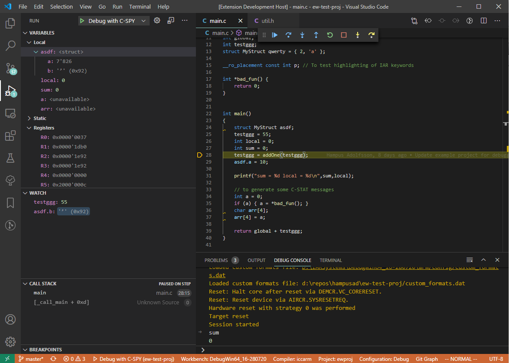
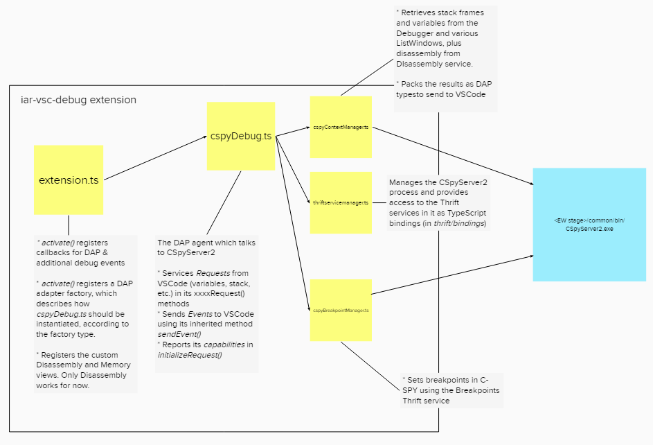

# IAR C-SPY Debugger extension for VS Code prototype

`iar-vsc-debug` is a VS Code extension based on `vscode-mock-debug`, an example project
from Microsoft for developing a Debug Adapter using the TypeScript SDK.
The extension provides a Debug Adapter that connects to an existing Embedded Workbench installation,
thus enabling minimal C-SPY debugging functionality in VS Code via the `common/bin/CSpyServer2.exe` executable
in the Embedded Workbench installation of choice.

The Debug Adapter implementation for C-SPY can be found in `src/dap/cspyDebug.ts`.

Please note that this is only a prototype and it is not meant for public distribution.

## Setup
Start by initializing the utils submodule. If the code was checked out using "--recursive" from git, everything is setup otherwise run "git submodule update --init" to get the pinned version of the 
utility repo. Run "git submodule update --remote" to get the latest available version of the repo. The folder can also be setup as a regular git repo by navigating to src/utils and run "git checkout master".

Open the workspace `iar-vsc-debug.vscode-workspace` in VS Code, and run `npm install` in the terminal. You should be prompted to install the recommended extension `iar-vsc`, described below.
### Installing the `iar-vsc` extension

To simplify the setup of a C-SPY launch for new projects, you should install the extension
`IAR for Visual Studio Code` (`iar-vsc`) from the marketplace (<https://marketplace.visualstudio.com/items?itemName=pluyckx.iar-vsc>).
Note that `iar-vsc` has been added to the recommendations for the workspace shipped with the debug extension.
This extension will create a default launch configuration which reuses some of the settings from `iar-vsc`, among which the
Embedded Workbench installation location.

## Configuring the Embedded Workbench installation

If the `iar-vsc` extension is installed, the debug extension will automatically use the same installation selected in it.
Otherwise the default `launch.json` file generated by the debug extension needs to be adjusted manually.

The debug extension has been tested with Embedded Workbench for ARM version 8.50.6 and newer.

## Debugging the sample workspace

Launch the `Extension` configuration from the debugging panel (the DAP adapter runs 'inline' in the extension and thus does not need a `Server` launch).
The launch will default to an the `samples/GettingStarted` VSCode workspace, containing an
Embedded Workbench project.

For some reason the `iar-vsc` build extension might clean the example project when you open the sample project. You can then build the project again using `Terminal > Run Task > iar > Build` and then debug it
selecting the `Debug with C-SPY` launch type.

## Debugging your own projects

To debug your own Embedded Workbench projects you should launch at least once with EW itself, so that
the `settings` folder in your project is populated with configuration files.

Then, open up `.vscode/launch.json` created by the debug extension within the project folder and make sure
you have a valid C-SPY launch configuration.

## Architectural overview
A "birds eye" view of the extension code follows:

